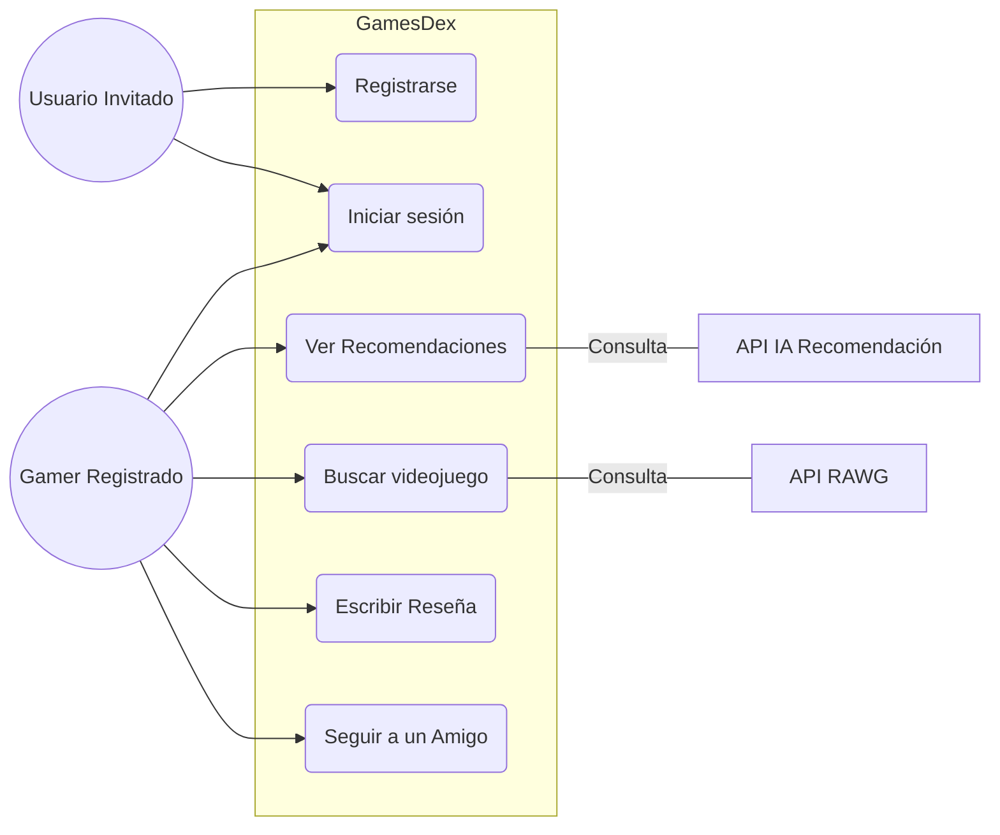
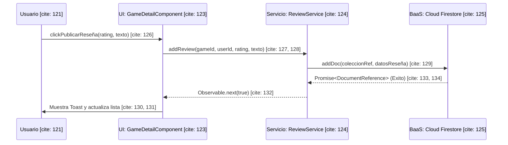

# Diagramas UML: GamesDex

## 1. Diagrama de Casos de Uso
[cite_start]Este diagrama define las interacciones entre los actores y las funcionalidades principales del sistema[cite: 78, 79].



## 2. Diagrama de Clases (Modelos de Datos)
[cite_start]Representa la estructura de los objetos y sus relaciones en la base de datos NoSQL.

```mermaid
classDiagram
    class User {
        +String uid
        +String displayName
        +String email
        +String photoUrl
        +String[] favoriteGenres
    } [cite: 91-99]

    class Follow {
        +String followerId
        +String followingId
        +Date date
    } [cite: 101-104]

    class Review {
        +String id
        +String userId
        +number gameId
        +number rating
        +String comment
        +Date date
    } [cite: 105-107, 112, 114, 116, 118]

    class Game {
        +number id
        +String title
        +String background_image
        +number rating
        +any[] platforms
        +string genres
    } [cite: 108-110, 113, 115, 117, 119]

    User "1" -- "*" Follow : Es seguidor en [cite: 93]
    User "1" -- "*" Follow : Es seguido en [cite: 97]
    User "1" -- "*" Review : Escribe [cite: 100]
    Review "*" -- "1" Game : Valora [cite: 111]
```

## 3. Diagrama de Secuencia (Publicar Reseña)
[cite_start] Muestra el flujo de ejecución desde la acción del usuario hasta la persistencia en el BaaS.

